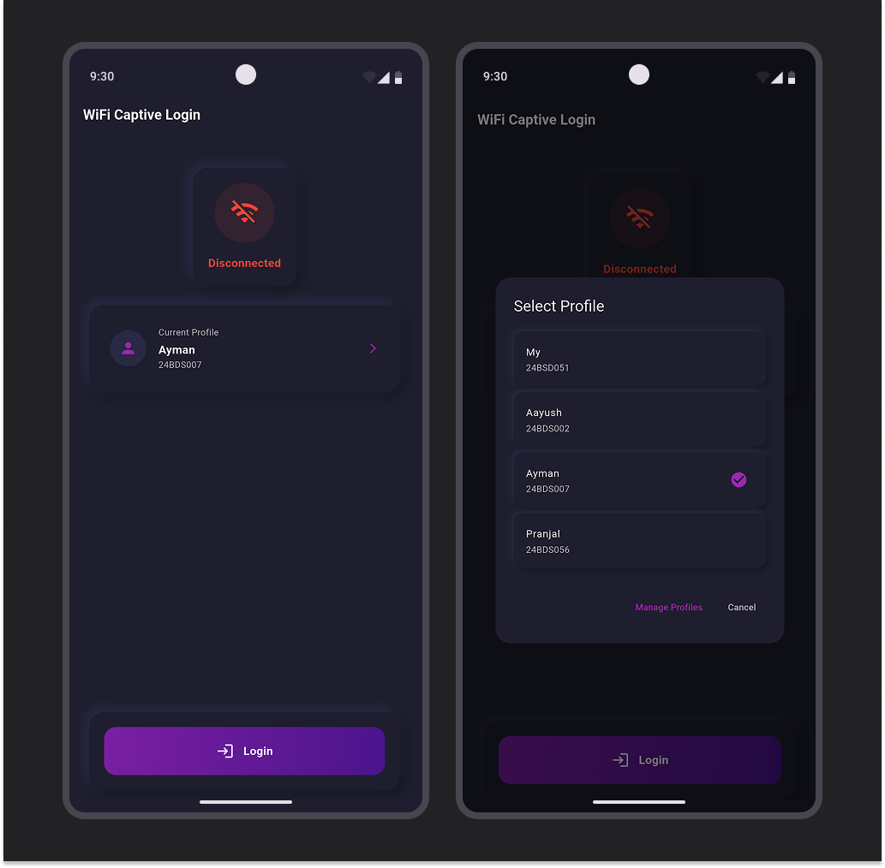
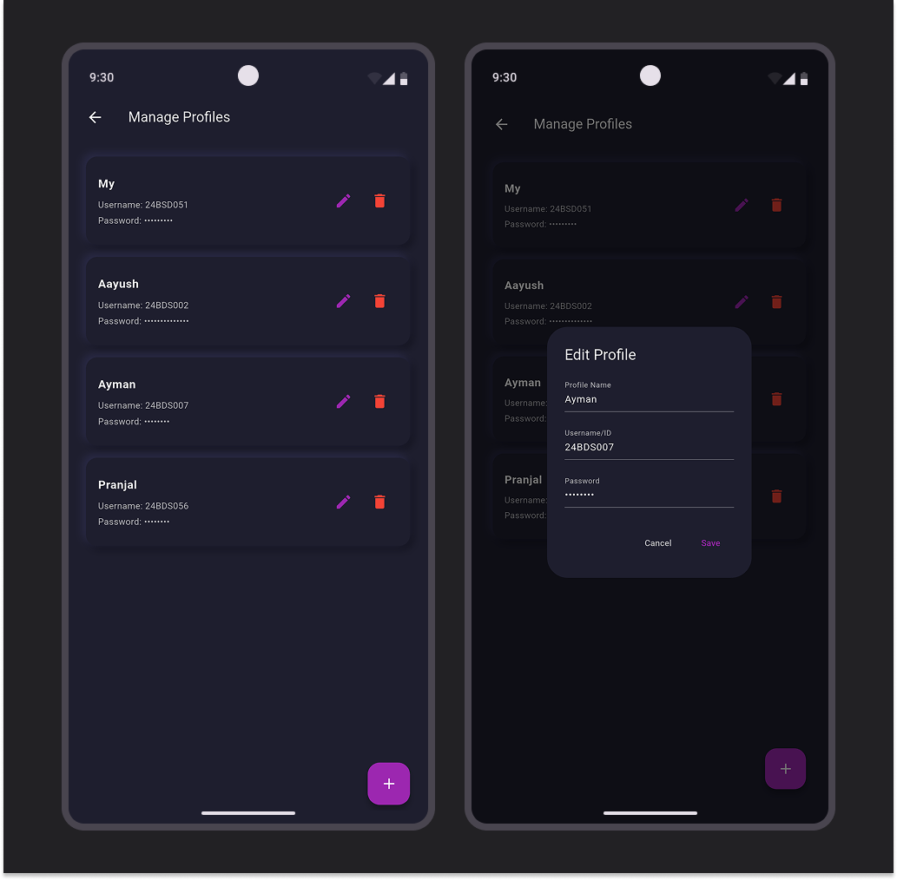

# Captive Logger Android

Captive Logger Android streamlines the process of connecting to and managing captive portal networks on campus. The app eliminates the hassle of manual login and provides a community-driven approach to sharing internet access among students.

## Screenshots

## Features

### 🔐 Automatic Portal Login
- Automatically logs into the captive portal without manual intervention
- Saves time and eliminates the repetitive task of entering credentials
- Works seamlessly with IIIT Dharwad's network infrastructure

### 📶 WiFi Sharing
- Share your internet connection with friends when they've reached their daily data limit
- Simple one-tap sharing mechanism
- Helps maintain connectivity for the entire student community

### 🤝 Data Request System
- Request internet access from other students when you run out of your daily limit
- Community-based approach to ensure everyone stays connected
- Built-in request and approval system

## Usage

1. **Setup**: Launch the app and enter your portal credentials on first run
2. **Auto-Login**: The app will automatically handle portal authentication when you connect to campus WiFi
3. **Share Connection**: Use the share feature to help friends who've exhausted their daily limit
4. **Request Data**: Send requests to other users when you need additional data access

## Contributing

Contributions are welcome! Please feel free to submit issues, feature requests, or pull requests.

1. Fork the repository
2. Create your feature branch (`git checkout -b feature/AmazingFeature`)
3. Commit your changes (`git commit -m 'Add some AmazingFeature'`)
4. Push to the branch (`git push origin feature/AmazingFeature`)
5. Open a Pull Request

**Note**: This app is specifically designed for IIIT Dharwad's network infrastructure and may not work with other captive portal systems without modification.